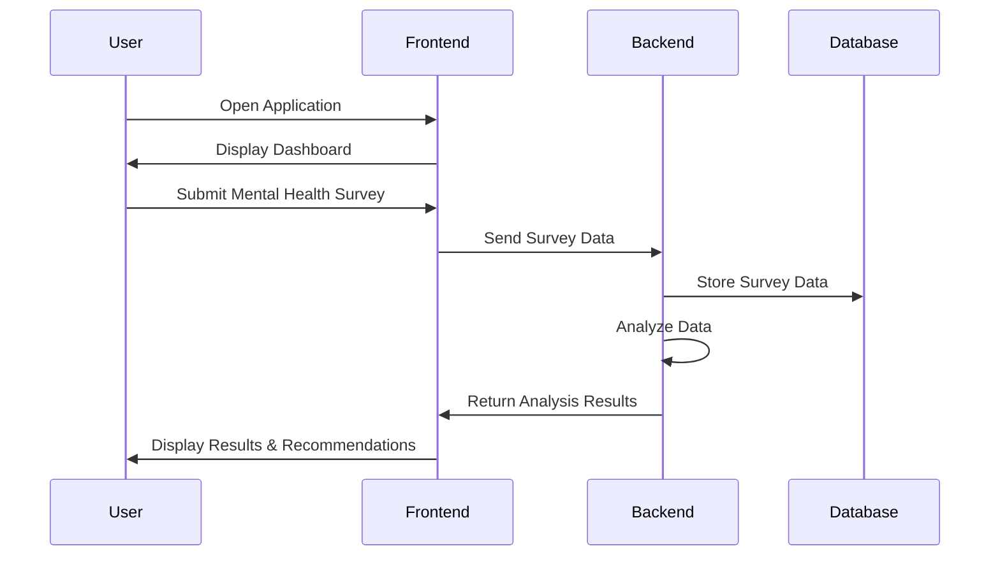

# Depression-Analyzer: Your Mental Health Companion 🌟

[](https://opensource.org/licenses/MIT)
[](https://github.com/your-repo/Depression-Analyzer/stargazers)

## Overview

Depression-Analyzer is a cutting-edge application designed to assist users in understanding and managing their mental health. By leveraging advanced algorithms, this tool provides insights and recommendations to help users navigate their emotional well-being. Whether you're looking for daily mental health check-ins or comprehensive analysis, Depression-Analyzer is here to support you.

## Architecture & Workflow

The application is structured into two main components: the backend (`back.py`) and the frontend (`front.py`). The backend handles data processing and analysis, while the frontend provides a user-friendly interface for interaction.



## Granular Tech Stack

- **Languages**: Python
- **Frameworks**: Flask (for backend API), React (for frontend)
- **Libraries**: Pandas, NumPy (for data processing), Matplotlib (for data visualization)
- **Tools**: Docker (for containerization), Git (for version control)

## Key Features

- 📊 Comprehensive mental health analysis
- 📝 Daily mental health check-ins
- 📈 Data visualization of mental health trends
- 💬 Personalized recommendations
- 🔍 Secure data storage and privacy

## Project Structure

```
Depression-Analyzer/
├── back.py
├── front.py
└── README.md
```

## Getting Started

### Prerequisites

- Python 3.x
- Node.js
- Docker

### Installation

Clone the repository:

```bash
git clone https://github.com/your-repo/Depression-Analyzer.git
cd Depression-Analyzer
```

Install the backend dependencies:

```bash
pip install -r requirements.txt
```

Install the frontend dependencies:

```bash
cd frontend
npm install
```

### Running the Project

Start the backend server:

```bash
python back.py
```

Start the frontend server:

```bash
cd frontend
npm start
```

## Usage

1. Launch the application in your browser.
2. Complete the mental health survey.
3. Review your analysis and personalized recommendations.

## Roadmap

- [ ] Integrate machine learning models for enhanced analysis
- [ ] Develop mobile application for iOS and Android
- [ ] Add multilingual support
- [ ] Implement user authentication and profile management

## Contributing

Contributions are welcome! Please read the [contributing guidelines](CONTRIBUTING.md) before submitting a pull request.

## License

This project is licensed under the MIT License - see the [LICENSE](LICENSE) file for details.
```
